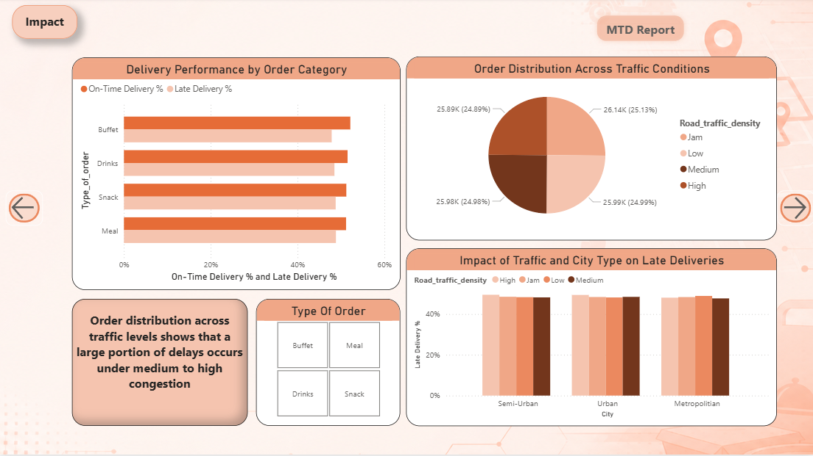
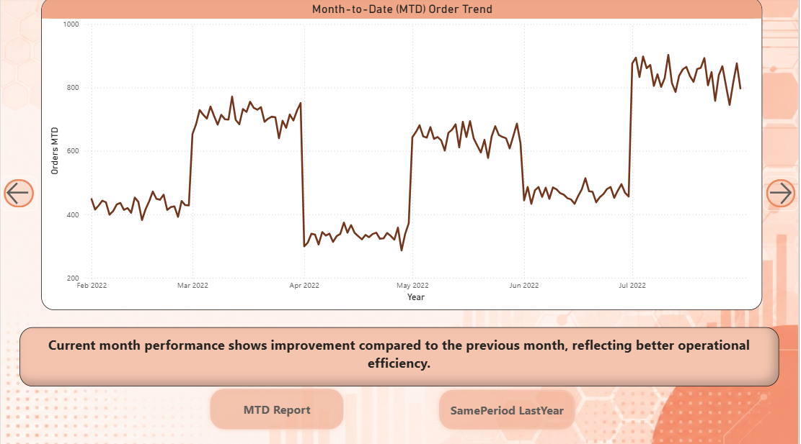
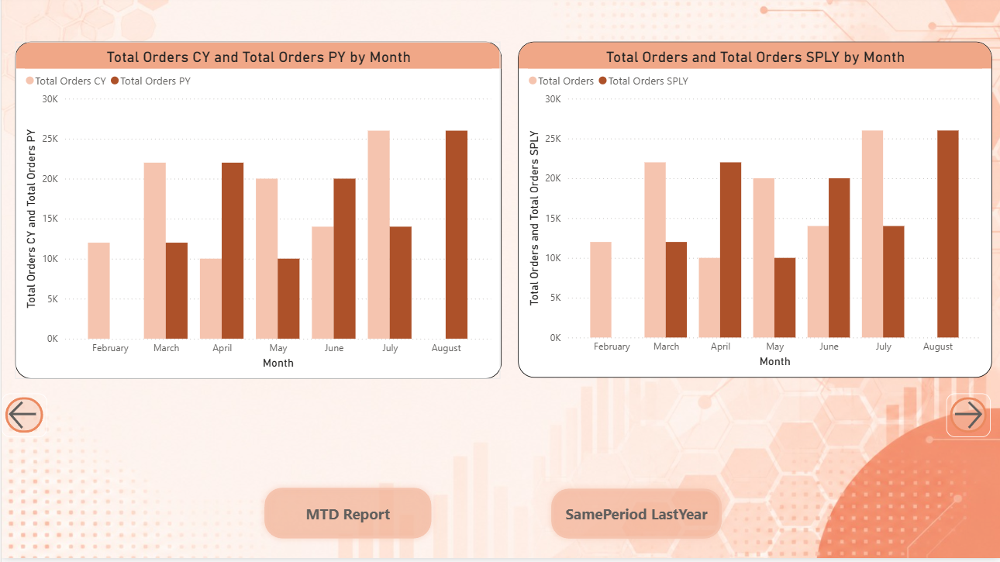
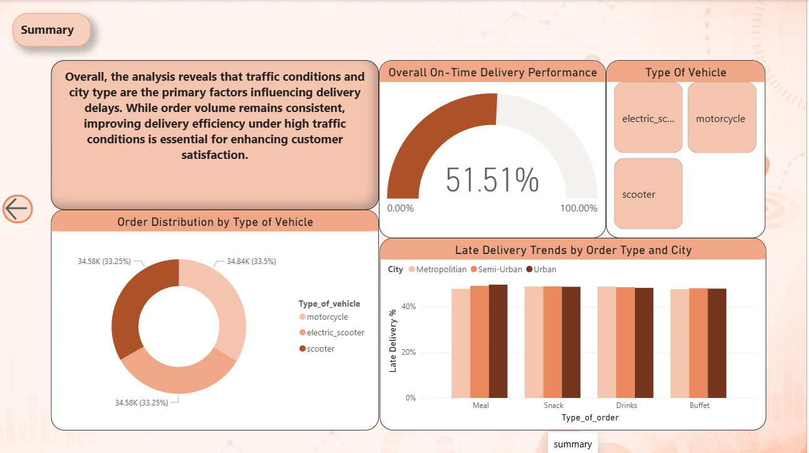

# 🍔 Food Delivery Insights Dashboard

## 📌 Project Overview

The Food Delivery Insights Dashboard is an interactive Power BI project designed to analyze and visualize food delivery business performance through dynamic dashboards and data-driven insights.

This project focuses on transforming raw operational and sales data into meaningful visual analytics to help understand revenue trends, customer behavior, delivery efficiency, and overall business growth.

The dashboard provides a modern and user-friendly interface with interactive filters, KPI cards, charts, and performance tracking visuals for effective decision-making.

---

# 🚀 Features

- Interactive Power BI Dashboard
- Dynamic KPI Monitoring
- Sales & Revenue Analysis
- Customer Insights
- Delivery Performance Tracking
- Trend Analysis Visualizations
- Category-wise Performance Analysis
- Interactive Filters & Slicers
- Modern UI/UX Dashboard Design

---

# 🛠️ Tools & Technologies Used

- Microsoft Power BI
- Power Query
- DAX (Data Analysis Expressions)
- Data Visualization Techniques
- Excel / CSV Dataset

---

# 📊 Dashboard Insights

The dashboard provides insights into:

- Total Revenue Generated
- Sales Performance Trends
- Customer Ordering Behavior
- Delivery Efficiency
- Monthly Growth Analysis
- Category-wise Business Performance
- Order Distribution
- Operational KPIs

---

# 🎯 Project Objectives

- Analyze food delivery business performance
- Convert raw data into actionable insights
- Monitor important KPIs effectively
- Improve decision-making using visualization
- Build a professional analytical dashboard

---

# 🖼️ Dashboard Preview

## Dashboard 1 — Introduction


---

## Dashboard 2 — Sales Overview


---

## Dashboard 3 — Revenue Analysis


---

## Dashboard 4 — Customer Insights


---

## Dashboard 5 — Delivery Performance



---

## Dashboard 6 — Trend Analysis



---

## Dashboard 7 — Operational Analytics



---

## Dashboard 8 — Final Dashboard Summary



---

# 📂 Repository Structure

```text
food-delivery-insights-dashboard
│
├── Mini project (1).pbix
├── README.md
└── screenshots
    ├── dashboard1.png
    ├── dashboard2.png
    ├── dashboard3.png
    ├── dashboard4.png
    ├── dashboard5.png
    ├── dashboard6.png
    ├── dashboard7.png
    └── dashboard8.png
```

---

# ⚡ How to Use

1. Download the `.pbix` file from this repository.
2. Open the file using Microsoft Power BI Desktop.
3. Refresh the dataset if required.
4. Explore the interactive dashboards and visualizations.

---

# 📈 Key KPIs Included

- Revenue Analysis
- Profit Tracking
- Total Orders
- Delivery Metrics
- Customer Metrics
- Business Growth
- Sales Trends
- Operational Performance

---

# 🔮 Future Improvements

- Real-time API Integration
- AI-based Predictive Analytics
- Advanced Forecasting Visuals
- Mobile Optimized Dashboard
- Automated Data Refresh
- Enhanced Interactive Reporting

---

# 🤝 Contribution

Contributions, suggestions, and improvements are welcome.

Feel free to fork this repository and submit pull requests.

---

# 📧 Contact

## GitHub
Add your GitHub profile link here

## LinkedIn
Add your LinkedIn profile link here

---

# ⭐ Support

If you found this project useful, give it a ⭐ on GitHub.
