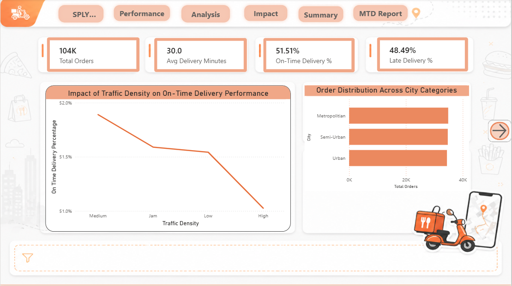
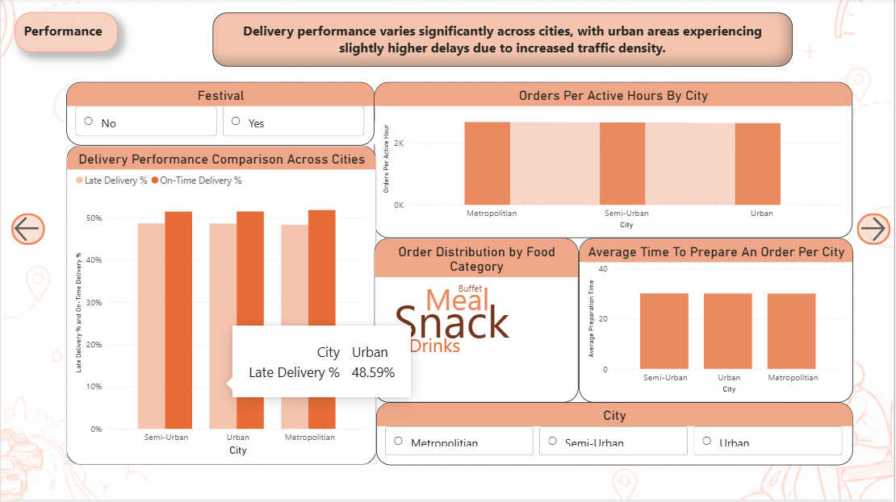
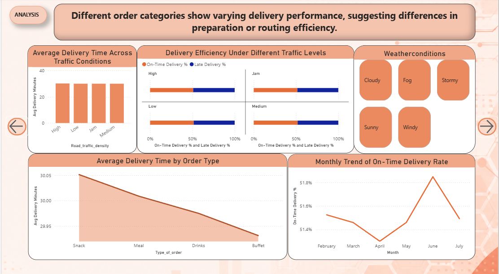

# 🍔 Food Delivery Insights Dashboard

## 📌 Project Overview

This Power BI dashboard provides comprehensive insights into food delivery business performance through interactive visualizations and analytics. The project focuses on analyzing sales trends, customer behavior, delivery performance, and operational KPIs to support data-driven decision making.

---

# 🚀 Features

- Interactive Power BI Dashboard
- Sales & Revenue Analysis
- Order Trend Monitoring
- Delivery Performance Tracking
- Customer Insights
- KPI Cards & Dynamic Filters
- Modern UI Dashboard Design
- Category-wise Performance Analysis

---

# 🛠️ Tools & Technologies Used

- Microsoft Power BI
- Power Query
- DAX (Data Analysis Expressions)
- Data Visualization Techniques
- Excel / CSV Dataset

---

# 📊 Dashboard Insights

The dashboard helps analyze:

- Total Revenue Generated
- Total Orders Delivered
- Customer Ordering Patterns
- Monthly Sales Trends
- Delivery Efficiency
- Top Performing Categories
- Business Growth Metrics
- Regional Performance Analysis

---

# 🖼️ Dashboard Preview

## Main Dashboard


## Sales Analysis



## Performance Insights



## Customer Analytics



---

# 📂 Repository Structure

```text
food-delivery-insights-dashboard
│
├── Mini project (1).pbix
├── README.md
├── screenshots
│   ├── dashboard1.png
│   ├── dashboard2.png
│   ├── dashboard3.png
│   └── dashboard4.png
```

---

# ⚡ How to Use

1. Download the `.pbix` file from this repository.
2. Open the file using Microsoft Power BI Desktop.
3. Refresh the dataset if required.
4. Explore the interactive dashboards and visualizations.

---

# 📈 Key KPIs Included

- Revenue
- Profit Analysis
- Total Orders
- Delivery Performance
- Customer Metrics
- Sales Growth
- Order Trends
- Category Performance

---

# 🎯 Project Objectives

- Transform raw business data into actionable insights
- Improve operational decision-making
- Visualize business performance effectively
- Track important KPIs dynamically
- Create a modern analytical dashboard

---

# 🔮 Future Improvements

- Real-time API integration
- Predictive analytics using Machine Learning
- Mobile responsive dashboard optimization
- Advanced forecasting visuals
- AI-driven business insights

---

# 🤝 Contribution

Suggestions and improvements are welcome.

Feel free to fork this repository and contribute.

---

# 📧 Contact

## GitHub
Add your GitHub profile link here

## LinkedIn
Add your LinkedIn profile link here

---

# ⭐ Support

If you found this project useful, give it a ⭐ on GitHub.
